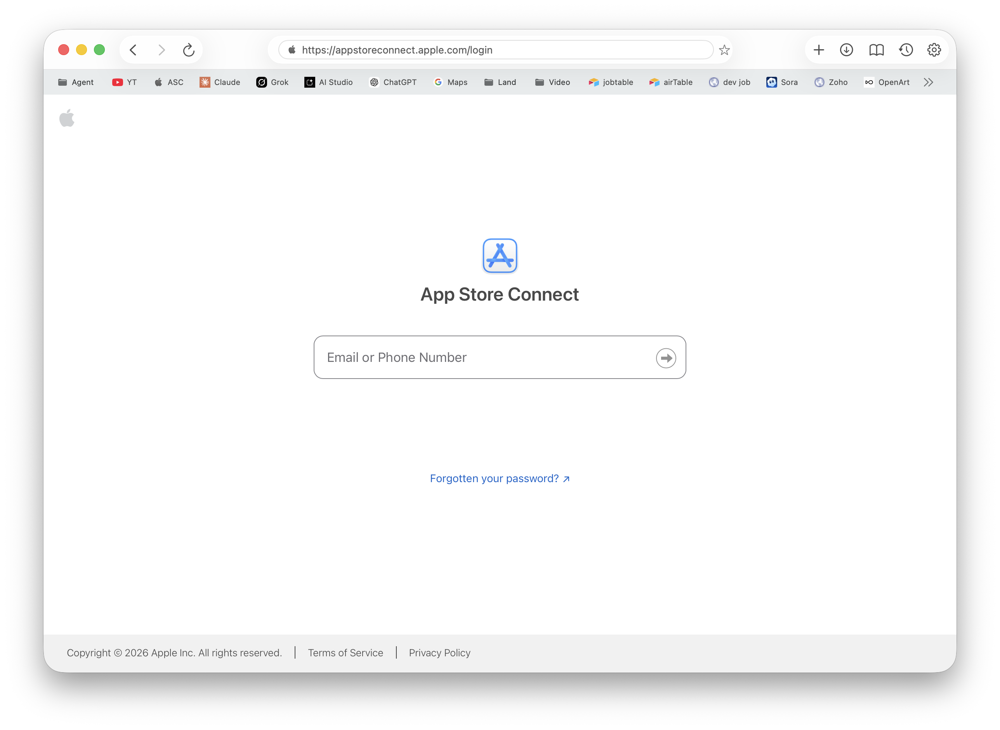
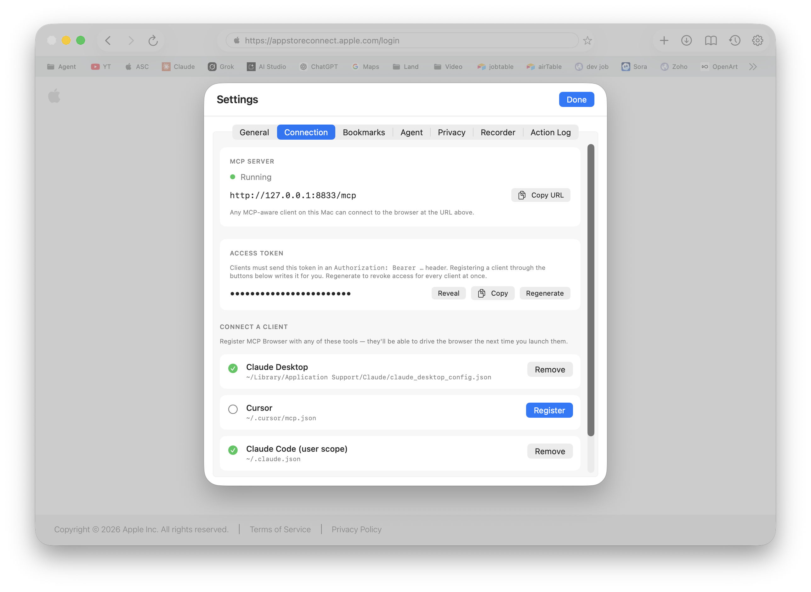

# MCP Browser

A native macOS web browser that exposes itself as a [Model Context Protocol](https://modelcontextprotocol.io) server, so AI agents can drive a real WKWebView the same way a person would — navigate, click, fill forms, read the DOM, take screenshots, run JavaScript, and capture network and console activity.

Built with SwiftUI + WKWebView. The MCP server runs in-process over local HTTP with bearer-token authentication and DNS-rebinding defense.

## Download

**[⬇ Download the latest macOS build](https://github.com/brainfuel/mcp-browser/releases/latest)** — signed, notarised `.dmg` for Apple Silicon.

After downloading, open the DMG and drag **MCP Browser** to your Applications folder.

## Screenshots





> Drop your own screenshots into `docs/images/` and update the filenames above.

## Why

Most "browser-as-a-tool" stories for agents fall into two camps:

1. **Headless automation** (Playwright, Puppeteer) — fast and scriptable, but the agent never sees what *you* see, can't share your logged-in sessions, and runs in a different browser engine than the one you trust.
2. **Remote-controlled cloud browsers** — your data leaves your machine, and you pay per session.

MCP Browser is the third option: a real browser window on your Mac that you log into, navigate, and use yourself — and that an LLM can drive through MCP when you ask it to. Cookies, history, bookmarks, and downloads stay local. The agent sees the same page you do.

## Features

### Browser
- **WKWebView**-backed tabs with a Safari-style tab strip (favicons, hover close, equal-width pills)
- **URL bar** with history + bookmark autocomplete
- **Bookmarks bar**, full bookmarks manager, history view, downloads popover
- **Find on page**, zoom-per-host persistence, picture-in-picture controller
- **Bookmark importer** (HTML / Safari / Chrome formats)
- **Per-tab cookie and network capture**

### MCP server
- **Local HTTP transport** on port `8833` (configurable) — `POST /mcp` for JSON-RPC, `GET /mcp` for SSE-style status
- **Bearer-token authentication** with a per-launch token, regeneratable from Settings
- **DNS-rebinding defense** — `Host` header validated against `127.0.0.1` / `localhost`
- **Auto-registration** with common MCP clients (Claude Desktop, Codex, etc.) via `MCPRegistrar`
- **Tool action log** — every tool call is recorded with arguments, result summary, and timing

### Tools (current catalog)
- **Navigation** — `navigate`, `back`, `forward`, `reload`, `current_url`, `current_title`
- **Tabs** — `list_tabs`, `new_tab`, `switch_tab`, `close_tab`
- **DOM** — `click`, `fill`, `submit`, `hover`, `press_key`, `type_text`, `scroll`, `find_in_page`, `get_element`, `accessibility_tree`
- **Page content** — `read_text`, `read_page`, `page_metadata`, `screenshot`, `pdf_export`, `render_html`, `eval_js`, `find`, `list_links`, `list_forms`
- **Cookies / storage** — `get_cookies`, `set_cookie`, `storage`, `clear_session`
- **Bookmarks** — `list_bookmarks`, `open_bookmark_folder`
- **Inspection** — `console_logs`, `network_log`, `dialog`
- **Files** — `download`, `upload_file` (gated by user permission)
- **Misc** — `wait_for`, `emulate`, `resize`

See [`MCP Browser/MCP/MCPToolCatalog.swift`](MCP%20Browser/MCP/MCPToolCatalog.swift) for the authoritative list.

### Privacy & safety
- **Per-launch bearer token** — clients without it get `401 Unauthorized`
- **Origin / Host validation** — blocks DNS-rebinding attacks from a malicious local web page
- **User confirmation** for downloads, uploads, and any `dialog` interactions
- **Local-only by default** — server binds to `127.0.0.1`, never the public network
- **Action log** in Settings → you can see exactly what an agent has done in your browser

## Requirements

- macOS 14+ (Sonoma or later)
- Xcode 16+ to build from source

## Getting Started (users)

1. Download the latest DMG from the [Releases](https://github.com/brainfuel/mcp-browser/releases/latest) page.
2. Drag **MCP Browser** to `/Applications` and launch it.
3. Open **Settings → Connection** to copy the bearer token and MCP endpoint URL.
4. In your MCP client (Claude Desktop, Codex, etc.) add the server. The app's **Settings → MCP Clients** tab can patch the config for the most common clients automatically.
5. Browse normally. When the LLM needs to do something on the web, it calls the tools through MCP and you'll see the action in the log.

## Getting Started (developers)

1. Clone this repository.
2. Open [`MCP Browser.xcodeproj`](MCP%20Browser.xcodeproj) in Xcode.
3. Select the `MCP Browser` scheme.
4. Build and run on **My Mac**.

CLI build:

```bash
xcodebuild -project "MCP Browser.xcodeproj" -scheme "MCP Browser" -configuration Debug build
```

### Building your own fork

The project ships with the original author's signing settings. If you're forking to build and ship your own copy:

1. **Development team** — open the `MCP Browser` target in Xcode → **Signing & Capabilities** → pick your own team. This rewrites `DEVELOPMENT_TEAM` in `MCP Browser.xcodeproj/project.pbxproj`.
2. **Bundle identifier** — change `PRODUCT_BUNDLE_IDENTIFIER` from `com.moosia.mcp-browser` to something you own.
3. **No API keys are bundled.** MCP Browser doesn't call any LLM provider itself — it only serves tools to whatever client connects.

## Configuring an MCP client

Most MCP clients accept an HTTP transport block. Example for `claude_desktop_config.json`:

```json
{
  "mcpServers": {
    "mcp-browser": {
      "transport": "http",
      "url": "http://127.0.0.1:8833/mcp",
      "headers": {
        "Authorization": "Bearer <token-from-settings>"
      }
    }
  }
}
```

The bundled **MCP Clients** settings tab can write this for you for the clients it knows about (Claude Desktop, Codex, etc.) — pick the client, hit **Add MCP Browser**, and it'll patch the file in place.

The token rotates each time you click **Regenerate token** in Settings → Connection. Re-patch your clients after rotating.

## Data Storage

- Bookmarks, history, zoom-per-host, downloads, and the action log are stored locally with `PersistentStore` (file-backed) and SwiftData where appropriate.
- The bearer token is stored in `UserDefaults`. It's regenerated from **Settings → Connection** whenever you want to revoke existing clients.
- Favicons are cached on disk under Application Support.
- No telemetry. No cloud sync. Nothing leaves the machine unless an MCP tool you invoke causes it to.

## Project Structure

```
MCP Browser/
├── Browser/         WKWebView wrapper, tab model, presenter, scripts, PiP
├── MCP/             MCP server, JSON-RPC, host protocol, tool catalog
│   ├── Registrar/   Auto-config patcher for Claude Desktop / Codex / etc.
│   └── Tools/       Tool implementations (navigation, DOM, content, etc.)
├── Settings/        Settings tabs (general, privacy, connection, recorder, etc.)
├── Storage/         Bookmarks, history, downloads, favicons, action log
├── Views/           Bookmarks bar, bookmarks manager, history, downloads popover
├── ContentView.swift     Top-level window layout, tab strip, URL bar
├── AppCommands.swift     Menu bar commands and keyboard shortcuts
└── MCP_BrowserApp.swift  App entry point and environment wiring
```

**Key files**
- [`MCP/MCPServer.swift`](MCP%20Browser/MCP/MCPServer.swift) — `NWListener`-based HTTP/JSON-RPC server, auth, rebind defense
- [`MCP/MCPCoordinator.swift`](MCP%20Browser/MCP/MCPCoordinator.swift) — routes tool calls to the focused window's active tab
- [`MCP/MCPToolCatalog.swift`](MCP%20Browser/MCP/MCPToolCatalog.swift) — registry of every exposed tool
- [`MCP/MCPSecret.swift`](MCP%20Browser/MCP/MCPSecret.swift) — Keychain-backed bearer token
- [`Browser/BrowserTab.swift`](MCP%20Browser/Browser/BrowserTab.swift) — per-tab `@Observable` model wrapping `WKWebView`
- [`Browser/WebViewHost.swift`](MCP%20Browser/Browser/WebViewHost.swift) — `NSViewRepresentable` bridge

## Security model

MCP Browser deliberately runs **un-sandboxed** so it can:

- Patch MCP-client config files in `~/Library/Application Support` / `~/.config`
- Drive other apps (e.g. open external schemes) when explicitly asked

It does **not**:

- Bind any network interface other than loopback (`127.0.0.1`)
- Accept connections without the per-launch bearer token
- Honor requests whose `Host` header doesn't match `127.0.0.1` or `localhost` (DNS-rebinding defense)
- Send anything off the machine on its own

If you're audit-minded, the entire HTTP surface is in `MCP Browser/MCP/MCPServer.swift` and is roughly 400 lines.

## Known Limitations

- The action log isn't yet retroactively searchable from the UI.
- Multi-window support exists but the MCP coordinator only routes to the most-recently-focused window.
- The OAuth and basic-auth flows for sites are handled by WebKit; MCP Browser itself does not store passwords. Use the system keychain through Safari/Chrome import for now.
- No mobile/iOS build — this is a Mac-only tool.

## Contributing

See [CONTRIBUTING.md](CONTRIBUTING.md) for how to file bugs, request features, and submit pull requests.

## License

[MIT](LICENSE)
